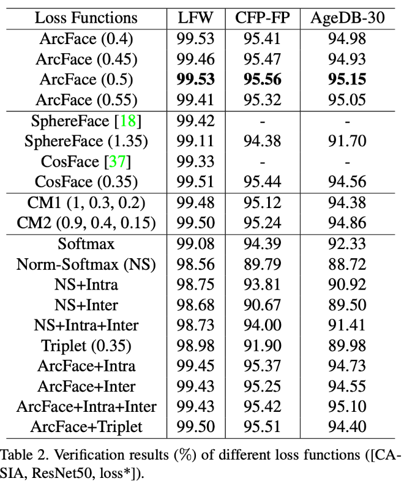

Face Recognition관련 논문은 FaceNet과 비교 위주로, 다른 논문은 내용만 정리하였습니다.  
논문과 리뷰를 참고하여 대략적으로 요약해보았는데, 잘못 해석했을 여지가 있습니다.. 고쳐야 할 부분이 있다면 조언해주시면 매우 감사하겠습니다

# 요약
1.	FaceNet(2015) -> SphereFace(2017) -> CosFace(2018) -> ArcFace(2019)
2.	학습에 쓰이는 얼굴 데이터와 실제 사용하는 얼굴 데이터가 다른 문제에 대한 논문
3.	가짜 얼굴 인식(spoofing) 관련 논문

# Face Recognition

### FaceNet: A Unified Embedding for Face Recognition and Clustering (CVPR 2015)
1.	https://arxiv.org/pdf/1503.03832v3.pdf
2.	요약   
얼굴의 feature를 추출하고 벡터화하여 학습에 사용하는 것이 특징. Squared L2 Distances(유클리드 거리의 제곱)은 얼굴 유사도를 나타내어 같은 사람이면 거리가 적음. 학습을 위해 얼굴 당 128byte의 작은 메모리만 필요함. 
3.	키워드: CNN with SGD, harmonic embeddings, harmonic Triplet loss

### ArcFace: Additive Angular Margin Loss for Deep Face Recognition (CVPR 2019)
1.	https://arxiv.org/pdf/1801.07698v3.pdf
2.	요약   
기존의 loss들의 한계를 보완한 새로운 Combined loss function제안(Softmax, triplet, SphereFace, CosFace와 비교)computational overhead가 무시해도 될 정도로 적음. 기존 loss function들과 비교. 성능이 매우 좋고 구현이 쉬움.
3.	키워드: large scale face recognition, Additive Angular Margin Loss

### Stacked Dense U-Nets with Dual Transformers for Robust Face Alignment (2018)
1.	https://arxiv.org/pdf/1812.01936v1.pdf
2.	요약   
Facial landmark localisation을 통해 얼굴 인식. 해결방법으로 Stacked dense U-Nets를 함. 두 가지 새로운 방법을 도입하여 데이터는 손상시키지 않으면서 모델 용량을 크게 줄였음. 2D와 3D에서 실험하였고, 3D에서 결과가 더 잘 나왔음. 포즈에 상관없이 얼굴을 인식할 수 있는 것이 장점. 굳이 3D까지 할 필요는 없을 듯!
3.	키워드: Facial landmark localisation, 3D

### SphereFace: Deep Hypersphere Embedding for Face Recognition (CVPR 2017)
1.	https://arxiv.org/pdf/1704.08063v4.pdf
2.	요약   
유클리드 공간으로의 매핑이 아닌 반지름 길이 1의 구의 공간으로 매핑함(Cosine 유사도 사용). 논문에서는 angular softmax loss를 도입하여 CNN 모델이 angularly discriminative feature를 학습할 수 있도록 하였음(더 분명하게 클래스를 구분할 수 있다는 말). FaceNet이 사용한 Euclidean의 경우, 학습되지 않은 이미지의 분류를 시도하면 추출된 feature vector가 다른 class로 분류될 수가 있음. A-Softmax는 weight vector만 normalize함
3.	키워드: A-Softmax loss

### CosFace: Large Margin Cosine Loss for Deep Face Recognition (CVPR 2018)
1.	https://arxiv.org/pdf/1801.09414v2.pdf
2.	요약   
기존의 softmax를 보완한 LMCL function제안. Weight vector와 feature vector를 둘 다 normalize하여 1~3% 정확도 향상. 정확도와 성능면에서 SphereFace와 비슷하고 데이터의 유형이나 필요에 따라 loss와 normalization을 다르게 적용할 것을 추천하고 있음.
3.	키워드: Large Margin Cosine Loss(LMCL)

# Related to Dataset

### Building Computationally Efficient and Well-Generalizing Person Re-Identification Models with Metric Learning (ICPR 2020)
1.	https://arxiv.org/pdf/2003.07618.pdf
2.	요약   
일반적으로 특정 데이터셋으로 학습시킨 모델은 다른 데이터에는 좋지 않은 성능을 보임. 특히 새로운 데이터셋이 작은 규모일 때 발생함. 논문에서는 이러한 교차 도메인 일반화 문제(학습에 쓰이는 얼굴과 도메인에서 쓰이는 얼굴이 다른 문제를 말하는듯, 교수님이 언급하셨던 그거?)를 OSNet(Omni-Scale Network) 아키텍처 등을 활용하여 MSMT17 데이터셋을 바탕으로 해결방안을 제시함.
3.	키워드: Re-Identification, AM-Softmax loss, OSNet

### Pose-Robust Face Recognition via Deep Residual Equivariant mapping (CVPR 2018)
1.	https://arxiv.org/pdf/1803.00839v1.pdf
2.	요약   
얼굴 인식 학습에 쓰이는 frontal 이미지와 test(?)에 쓰이는 profile 이미지 간의 차이는 인식을 어렵게 하는 요인이 될 수 있음. 논문에서는 이 둘 사이에 고유한 매핑이 있다고 가정하고, 이 매핑을 활용(? exploit)하기 위해 Deep Residual EquivAriant Mapping(DREAM) block을 사용함. DREAM block을 사용하면 ResNet과 같은 모델에서 profile face recognition의 정확도를 향상시킬 수 있음. Profile face에 대한 별도의 augmenting도 필요 없음! 쓰기 쉽고 가볍고 오버헤드도 적다고 함.
3. 키워드: DREAM block

# Face Anti-Spoofing

### A Dataset and Benchmark for Large-scale Multi-model Face Anti-spoofing (CVPR 2019)
1.	https://arxiv.org/pdf/1812.00408v3.pdf
2.	요약
Anti-spoofing이란 가짜로 얼굴 인식하는 것 같고, face-recognition의 보안 측면에서 매우 중요한 task임. 기존의 anti-spoofing benchmark에는 subject(~170), modality(~2)의 개수에 한계가 있었음. 논문에서는 이를 해결하기 위해 21000 video로 이루어진 1000 subject와 3 mode를 지원하는 large-scale multi-modal 데이터셋을 제공하고 있음. 데이터셋 외에도 평가를 위한 protocol이나, training/validation/testing sebset을 제공함.
3.	키워드: Anti-spoofing for face-recognition

# 참고한 사이트
https://paperswithcode.com/task/face-recognition
https://minus31.github.io/2019/04/08/ArcFace/
ArcFace에 대한 설명
https://tmaxai.github.io/post/review_SphereFace/ SphereFace와 CosFace에 대한 설명, 목적에 맞는 오픈 데이터셋 선택 팁 있음
